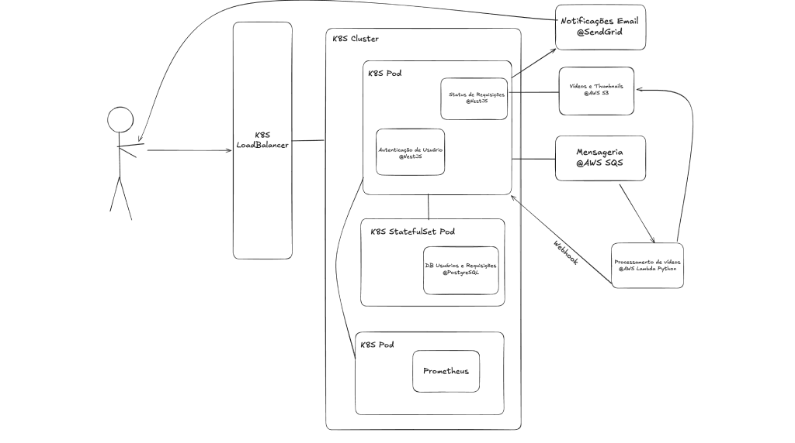
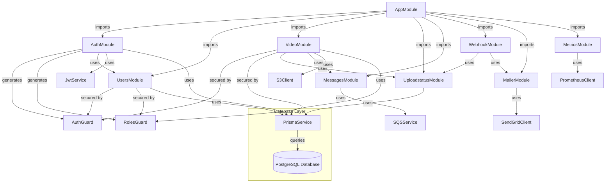

# Hackathon FIAP 7SOAT Grupo #49

Application that takes a video input and generates a zip with video thumbnails.

## Event Storm and System Design

Event Storm: https://miro.com/app/board/uXjVLwQ1nKA=/?share_link_id=710039569837

System Design:

## Tech Stack

- TypeScript
- Python
- NestJS
- PostgreSQL
- Docker
- Kubernetes
- AWS S3
- AWS SQS
- AWS Lambda
- Azure AKS
- Prometheus

## To run Local Kubernetes Environment

1. Generate a config map based on your local `.env` file with the command `kubectl create configmap my-config --from-env-file=.env` **needs to be updated every time the SESSION TOKEN changes**
2. Run `kubectl apply -f k8s/postgres-deployment.yaml`
3. Run `kubectl apply -f k8s/deployment.yaml`
4. Run `kubectl apply -f k8s/service.yaml`
5. Execute `kubectl get services`
6. Get the **external port** from the hackathon-nest and then in your browser navigate to `http://localhost:ExternalPort/api`

## Module Relationship Structure

